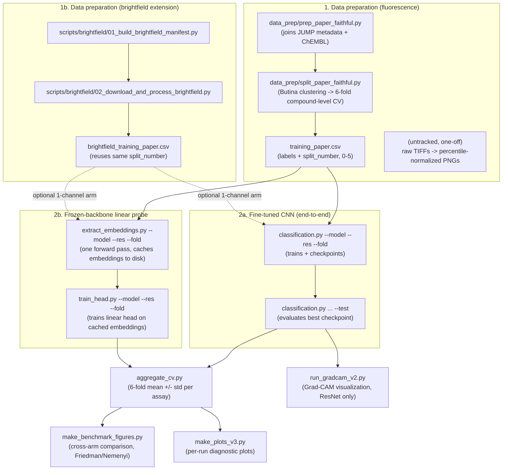

# Project Bioactive

**Benchmarking pretrained vision models for Cell Painting compound-bioactivity prediction.**

A faithful replication and extension of Fredin Haslum et al., *Nature Communications* 15:3470 (2024). We reproduce the supervised ResNet-50 baseline and benchmark it against a broad set of pretrained vision backbones (frozen linear probe and parameter-efficient adaptation) spanning several pretraining paradigms, on an identical data split and evaluation protocol.

## Results

**Full 6-fold CV benchmark, compound-level aggregation (corrected 2026-10-03).** This replaces
the single-fixed-fold comparison previously reported here -- see "Evaluation protocol fix" below
for what changed, why, and how large the correction was.

| Regime | Model | Resolution | Test ROC-AUC (6-fold CV) |
|---|---|---|---|
| Fine-tuned | ResNet-50 | 448 | **0.6792 ± 0.0245** |
| Fine-tuned | ResNet-50 | 224 | 0.6638 ± 0.0153 |
| Frozen probe | DINOv3-Base | 448 | 0.6448 ± 0.0180 |
| Frozen probe | Cell-DINO | 224 | 0.6373 ± 0.0119 |
| LoRA (2.4% trainable) | DINOv2-Small + LoRA | 224 | 0.6373 ± 0.0203 |
| Frozen probe | DINOv2-Base | 224 | 0.6345 ± 0.0162 |
| Frozen probe | DINOv3-Base | 224 | 0.6332 ± 0.0142 |
| Frozen probe | DINOv2-Large | 224 | 0.6313 ± 0.0202 |
| Frozen probe | DINOv2-Small | 224 | 0.6283 ± 0.0144 |
| Frozen probe | CLIP ViT-L/14 (locked recipe) | 224 | 0.6267 ± 0.0164 |
| Frozen probe | BiomedCLIP | 224 | 0.6245 ± 0.0166 |

Mean ROC-AUC over 29 assays, 6-fold CV, compound-level aggregation (matching the reference
paper's protocol). **Public JUMP-CP benchmark (Haslum et al. 2024): 0.660 ± 0.094 (6-fold CV)** --
kept here as the external reference point; it is a different number from any row in this table,
all of which are this project's own reproduction/extension results. Resolution is
model-dependent: 448 helps fine-tuned ResNet-50 and frozen DINOv3-Base, but *hurts* every other
frozen DINO-family backbone (Cell-DINO, DINOv2-Base, DINOv2-Large) -- see
`results_showcase/benchmark_figures/README.md` for the full resolution comparison.

**Key finding:** under correct compound-level aggregation and rigorous 6-fold CV with Friedman +
Nemenyi testing, no frozen backbone is statistically distinguishable from any other frozen
backbone, and the best frozen backbone (Cell-DINO, domain-matched pretraining) is statistically
indistinguishable from the fully fine-tuned ResNet-50 (Nemenyi p=0.7693). This is a substantial
revision of the project's earlier headline claim that pretraining-domain match clearly separates
backbones and that fine-tuning clearly beats frozen features -- neither holds up once predictions
are correctly aggregated to compound level. Fine-tuning remains the strongest arm *on average*,
and still significantly beats three of the six frozen arms (DINOv3-Base, BiomedCLIP, CLIP ViT-L/14),
but the margin claimed in earlier analyses did not survive correction. See
`results_showcase/benchmark_figures/README.md` for the full statistical comparison and
`docs/Project_Bioactive_Methodology.docx` for methodology (note: the methodology doc predates
this correction and has not yet been updated).

## Task

Cell Painting five-channel fluorescence microscopy images to compound bioactivity, framed as masked multi-label classification over 29 assays (labels +1 active / -1 inactive / 0 not-tested; the loss masks untested entries).

## Repository layout

- `classification.py` — entry point (`--params_path`, `--test`)
- `defaults/` — model definitions, trainer, optimizer wrappers, datasets
- `utils/` — masked BCE loss, per-assay ROC-AUC metrics, helpers
- `params/` — one JSON config per benchmarked model
- `data_prep/` — paper-faithful data preparation scripts + data-download docs
- `make_plots_v2.py`, `make_comparison_figures.py` — figure generation
- `apply_early_stopping.py` — trainer early-stopping patch utility
- `results/` and comparison figures — test result logs, per-assay AUC CSVs
- `docs/` — methodology document

## Not included (live on the compute server, excluded via .gitignore)

- Images — five-channel Cell Painting microscopy (~2 TB)
- Training CSV — produced by the paper-faithful preparation scripts in `data_prep/`
- Checkpoints — trained model weights (1.4–4.8 GB each)
- Pretrained weights — loaded from a local Hugging Face cache (server runs offline)

## Pipeline overview & How to reproduce

This section documents the actual end-to-end pipeline behind the Results
table above: which files run in what order, for both training regimes, and
how everything converges into the final figures. The "Reproducing a run"
section further below describes an earlier, single-model CLI pattern and is
kept only as a historical record — use this section instead.

**Honesty note:** the step that builds the five-channel fluorescence
training images (percentile-normalized PNGs from raw Cell Painting TIFFs)
was a one-off process run early in the project and is *not* tracked as a
script in this repo. If you are reproducing from scratch, you will need to
rebuild an equivalent step yourself, or start from `data_paper.csv` /
`split_data_paper.csv` plus already-built images. The newer brightfield
extension (see below) *is* fully scripted end to end, under
`scripts/brightfield/`, and can serve as a template for that image-building
step.

### Flow diagram



### File-role manifest

| File | Role | Regime |
|---|---|---|
| `data_prep/prep_paper_faithful.py` | Builds labeled compound dataset (JUMP metadata + ChEMBL join) | Fluorescence data prep |
| `data_prep/split_paper_faithful.py` | Butina clustering → compound-level 6-fold `split_number` | Fluorescence data prep |
| `scripts/brightfield/01_build_brightfield_manifest.py` | Joins `training_paper.csv` against per-plate S3 load-data files to locate brightfield TIFFs | Brightfield data prep |
| `scripts/brightfield/02_download_and_process_brightfield.py` | Downloads TIFFs from the public JUMP-CP S3 bucket, percentile-normalizes, writes 1-channel PNGs | Brightfield data prep |
| `scripts/brightfield/04_compute_brightfield_stats.py` | Computes real per-channel mean/std from downloaded images | Brightfield data prep |
| `classification.py` | Main CLI: trains (or `--test` evaluates) one model/resolution/fold. Used directly for fine-tuned CNNs; its arg-parsing is reused by `extract_embeddings.py` | Both (entry point) |
| `extract_embeddings.py` | Runs a frozen backbone once per CV split, caches `{embeddings, labels, uids}` to disk — mirrors `classification.py`'s CLI exactly | Frozen probe |
| `train_head.py` | Trains a linear head on cached embeddings; evaluates on TEST split with compound-level aggregation, writes `per_assay_auc.csv` | Frozen probe |
| `aggregate_cv.py` | Aggregates the 6 CV folds into mean ± std test ROC-AUC per model/resolution | Both (convergence point) |
| `make_benchmark_figures.py` | Cross-arm publication figures + `benchmark_summary.csv` (model comparison, resolution effect, Friedman/Nemenyi) | Both (final viz) |
| `make_plots_v3.py` | Per-run diagnostic plots for one `model_name` | Both (final viz) |
| `run_gradcam_v2.py` | Grad-CAM visualization for a fine-tuned ResNet-50 | Fine-tuned CNN (inference/viz) |
| `defaults/models.py` | Model definitions, including channel-adaptation logic for brightfield (1-channel) arms | Shared |
| `defaults/datasets.py` | Dataset classes, including `BioActBrightfield` | Shared |

### Exact commands

**1. Data prep (fluorescence, run once):**
```bash
python3 data_prep/prep_paper_faithful.py
python3 data_prep/split_paper_faithful.py
```

**1b. Data prep (brightfield extension, run once):**
```bash
python3 scripts/brightfield/01_build_brightfield_manifest.py
python3 scripts/brightfield/02_download_and_process_brightfield.py --workers 16
python3 scripts/brightfield/04_compute_brightfield_stats.py
```

**2a. Fine-tuned CNN — train, then test, for each fold:**
```bash
export WANDB_MODE=disabled HF_HUB_OFFLINE=1 TRANSFORMERS_OFFLINE=1
export HF_HOME=~/.cache/huggingface
export PYTORCH_CUDA_ALLOC_CONF=expandable_segments:True

for fold in 0 1 2 3 4 5; do
  python3 classification.py --model resnet --res 448 --fold $fold
  python3 classification.py --model resnet --res 448 --fold $fold --test
done
```

**2b. Frozen-backbone linear probe — extract embeddings once, then train the head, for each fold:**
```bash
for fold in 0 1 2 3 4 5; do
  python3 extract_embeddings.py --model dino --res 224 --fold $fold
  python3 train_head.py --model dino --res 224 --fold $fold
done
```
(`--model` accepts any `MODEL_MAP` key from `classification.py`, e.g. `dino`, `celldino`, `clip`, `biomedclip`; resolution is `224` or `448`.)

**3. Aggregate the 6 folds into mean ± std:**
```bash
python3 aggregate_cv.py <model> <res>
# e.g. python3 aggregate_cv.py resnet 448
```

**4. Generate figures / run inference-side visualization:**
```bash
python3 make_benchmark_figures.py          # cross-arm comparison figures + benchmark_summary.csv
python3 make_plots_v3.py bioact_resnet_r448_fold0   # per-run diagnostic plots
python3 run_gradcam_v2.py --targets <csv_of_targets> --out <output_dir> --model resnet --res 448
```

## Reproducing a run (legacy single-model CLI — superseded by the Pipeline overview above)

Each model uses the same recipe; only the params file differs.

**Train:**

export WANDB_MODE=disabled HF_HUB_OFFLINE=1 TRANSFORMERS_OFFLINE=1

export HF_HOME=~/.cache/huggingface

export PYTORCH_CUDA_ALLOC_CONF=expandable_segments:True

python3 classification.py --params_path params/params_<model>.json

**Test** (restores the best checkpoint, evaluates the test fold):
python3 classification.py --params_path params/params_<model>.json --test

**Generate figures:**
python3 make_plots_v2.py bioact_<model>        # per-model

python3 make_comparison_figures.py             # cross-model

## Experimental design (original single-fold comparison, superseded above)

*The design below describes the project's original ResNet-50 vs. DINOv2-Base/CLIP/BiomedCLIP
comparison: a single fixed fold, with the three ViTs fully fine-tuned end-to-end (AdamW). This
predates, and uses a different recipe and evaluation protocol from, the frozen-linear-probe
6-fold CV benchmark reported in "Results" above (locked SGD recipe, `extract_embeddings.py` +
`train_head.py`, compound-level aggregation). It is kept here as a record of the project's first
pass; the current main benchmark is the one above.*

- **Single fixed fold** (folds 0–3 train / 4 val / 5 test) — identical across all models, so model-to-model comparison is internally valid. Comparison to the paper's 6-fold CV mean is indicative.
- **Per-architecture hyperparameters** — ResNet-50: SGD, lr 1e-3, batch 64. All three ViTs: AdamW, lr 1e-4, batch 16 (matched). ReduceLROnPlateau scheduling for all.
- **Resolution** — ResNet-50 and DINOv2 at 448; CLIP-family at native 224 (positional embeddings do not transfer to 448). Field of view held identical across all models.
- **Single seed** — run-to-run variance ≈ ±0.02 ROC-AUC; only differences above this scale are interpreted. Model ordering is robust to it.

Full reasoning and limitations are in `docs/Project_Bioactive_Methodology.docx`.

## Reference

Fredin Haslum, J. et al. *Cell Painting-based bioactivity prediction boosts high-throughput screening hit-rates and compound diversity.* Nature Communications 15, 3470 (2024).

## Evaluation protocol fix — frozen-backbone models (2026-10-03)

### What was wrong

All six-fold CV results for frozen-backbone models (DINOv2 small/base/large,
DINOv3-Base, Cell-DINO, CLIP ViT-L/14, BiomedCLIP — anything trained via
`extract_embeddings.py` + `train_head.py`) were computed on **raw per-image
predictions, with no aggregation across a compound's multiple site images**.

The fine-tuned CNN pipeline (`classification.py` → `defaults/trainer.py` →
`utils/metrics.py`'s `evaluate_predictions()`) has always aggregated
predictions to compound level before scoring:

```python
preds[assays] = sigmoid(preds[assays].values)
preds_combined = preds.groupby("compound").mean()
```

`train_head.py` — which evaluates a linear head on cached, frozen-backbone
embeddings — never had an equivalent step. It scored every image
independently:

```python
test_logits = head(Xte.to(device)).cpu().numpy()
test_mean, _ = mean_roc_auc(Yte.numpy(), test_logits, do_sigmoid=True)
```

### Why that matters

Every assay label is a compound-level property (ChEMBL potency annotation,
not an image-level one) — all site images of the same well carry an
identical label. Scoring each image as an independent test case is
pseudo-replication: correlated, repeated observations of one ground truth
were fed into the AUC calculation as if they were independent samples, and
skipping the averaging step left in per-image noise (site-to-site cell
confluence, debris, illumination variation) that the multi-site imaging
protocol is specifically designed to be averaged away. Single-image scoring
systematically under-estimates a model's true compound-level discriminative
power.

### Impact

Found while building a matched fluorescence baseline for a brightfield
imaging ablation and noticing the evaluation code paths diverged. A
retrospective audit of all frozen-backbone results showed every one
under-reporting AUC by ~0.04–0.05:

| Model | Per-image (uncorrected) | Compound-level (corrected) | Δ |
|---|---|---|---|
| DINOv3-Base r448 | 0.5907 | **0.6448** | +0.0541 |
| Cell-DINO r224 | 0.5932 | 0.6373 | +0.0441 |
| DINOv2-Base r224 | 0.5796 | 0.6345 | +0.0549 |
| DINOv3-Base r224 | 0.5804 | 0.6332 | +0.0528 |
| DINOv2-Large r224 | 0.5790 | 0.6313 | +0.0523 |
| DINOv2-Small r224 | 0.5786 | 0.6283 | +0.0497 |
| CLIP ViT-L/14 r224 | 0.5798 | 0.6267 | +0.0469 |
| BiomedCLIP r224 | 0.5774 | 0.6245 | +0.0471 |

Mean over 6 folds, all 29 assays, all `b-r-singh1` runs. (DINOv3 r224/r448
and CLIP r224 results under `b-b-parihar` could not be corrected
retroactively — raw per-image predictions were never saved for those runs,
only the aggregate `per_assay_auc.csv`.)

**The best frozen model changes as a result: DINOv3-Base r448 (0.6448), not
Cell-DINO r224 (0.6373).** Fine-tuned CNN results (ResNet-50, ResNet-18,
EfficientNet-B3) and the LoRA parameter-efficient arm were unaffected — both
go through `trainer.py`/`metrics.py` and already aggregated by compound
correctly.

### Fix applied

- `train_head.py` now builds a `(plate, well) → compound` lookup from
  `training_paper.csv`, maps each cached embedding's `uid`
  (`PLATE/WELL_SITE.png`) back to its compound, averages sigmoid
  probabilities per compound, and computes AUC on the aggregated values —
  matching `evaluate_predictions()`'s logic exactly. The old per-image mean
  is still recorded (as `test_mean_roc_auc_per_image_UNCORRECTED` in
  `head_metrics.json`) for audit purposes, but is no longer the reported
  metric.
- All historical results for the 8 affected models (48 fold-runs) were
  corrected in place by re-aggregating their already-saved per-image
  `test_preds.csv`/`test_labels.csv` — no retraining was needed, since the
  frozen backbone and trained head weights were untouched by this fix. The
  original per-image files are preserved alongside the corrected ones as
  `test_preds_per_image_UNCORRECTED.csv`, `test_labels_per_image_UNCORRECTED.csv`,
  and `per_assay_auc_per_image_UNCORRECTED.csv` in each fold's `plots/`
  directory.

### Resolved (2026-10-03)

- **The top "Results" table has been regenerated** from the corrected 6-fold
  CV numbers (see above), replacing the old single-fixed-fold comparison.
- **All benchmark figures/tables were regenerated** (`make_benchmark_figures.py`,
  `make_adaptation_figure.py`, `make_pr_calibration_pareto.py`) from the
  corrected `per_assay_auc.csv` files -- see `results_showcase/benchmark_figures/`.
  (Wilcoxon was dropped from this pass; Friedman + Nemenyi remain.) All 11
  affected `results_showcase/<model>/README.md` narratives were fully
  rewritten, not just number-swapped, since several statistical conclusions
  changed or reversed under correction (see each folder's README for specifics;
  the resolution-effect reversal and the Cell-DINO/ResNet50 significance
  collapse are the two largest).
- **Parihar's `dinov3_r224`/`dinov3_r448`/`clip_r224` runs were re-run** with
  the patched `train_head.py` against his own cached embeddings (read-only;
  all new output kept under this account's own directory tree, never written
  into his). Results are in `results_showcase/parihar_*` and kept separate
  from this account's own same-backbone numbers rather than merged, since the
  two differ meaningfully (e.g. DINOv3-Base r448: 0.6448 here vs. 0.6170 for
  Parihar's independently-extracted embeddings).
- Additionally found and fixed during this pass: `train_head.py`'s
  **validation-time** scoring (used for early stopping / checkpoint
  selection) had the same per-image aggregation bug as the test-time scoring
  above. Patched to score validation at compound level too. Spot-checked
  before trusting the already-reported numbers: the old per-image validation
  metric and the corrected compound-level one agreed on epoch-to-epoch
  ordering 97-99% of the time, and picked checkpoints within 0.0001 ROC-AUC
  of each other -- so no retraining was needed and no already-reported
  number changes, but future runs are now scored correctly end to end.
- `clip_vitl14_adamw_224` (a different training recipe -- AdamW, full-image,
  not the locked SGD linear-probe recipe shared by every frozen arm) was
  removed from `results_showcase/` as an invalid peer comparison, rather than
  corrected -- it was never comparing like with like.
