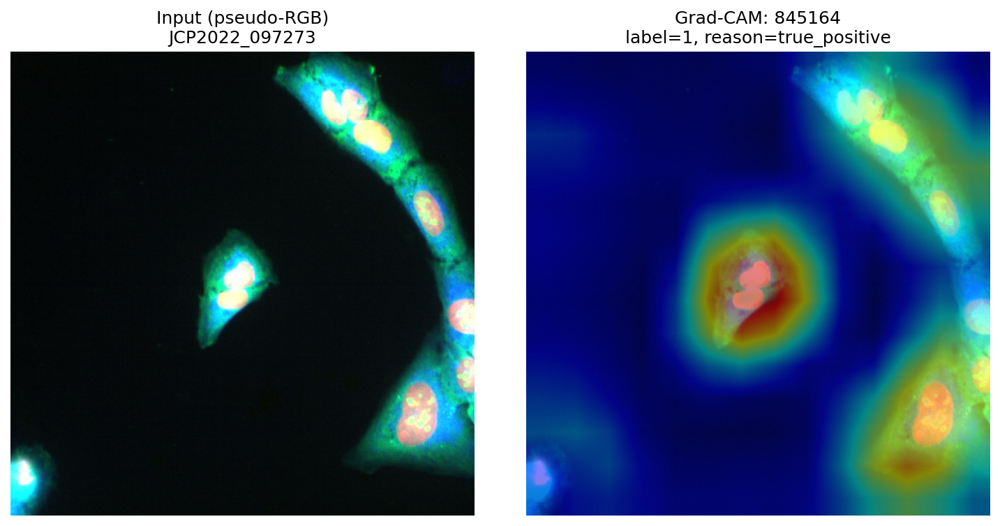
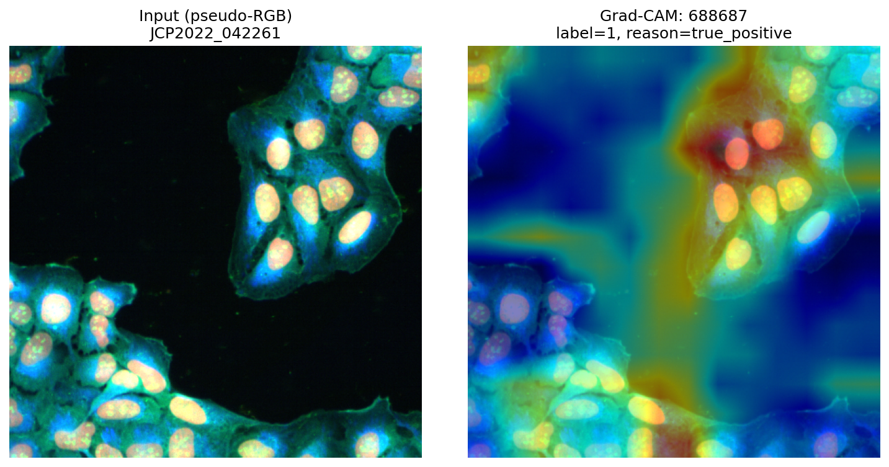
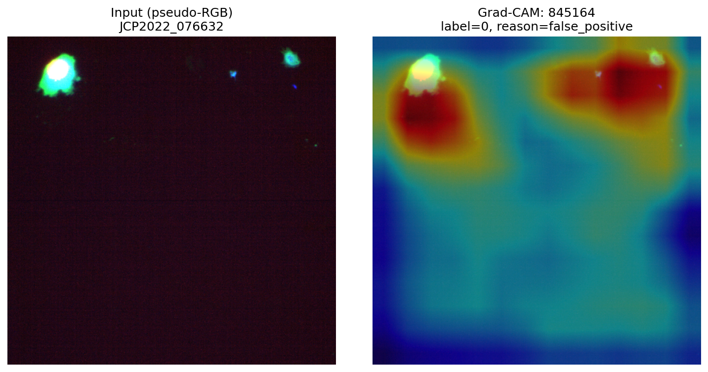

# Grad-CAM — Explainability for ResNet50 Compound-Bioactivity Predictions

Class-discriminative Grad-CAM attribution maps for the ResNet50 model,
targeting specific assay output logits through layer4[-1] (the last
convolutional block). Each heatmap shows which spatial regions of a
Cell Painting image the model attends to when predicting bioactivity
for a given assay.

## Method

For each (compound, assay) pair, Grad-CAM computes the gradient of the
target assay output logit with respect to the final convolutional
feature maps (layer4[-1]), producing a spatial attribution of shape
(H, W). The attribution is overlaid on a pseudo-RGB rendering of the
5-channel Cell Painting image (Mito to R, RNA to G, DNA to B).

Targets were selected to span the model confidence spectrum:
- High-AUC assays (top performers): true positives and false positives at high prediction confidence
- Mid-AUC assays (median performers): true positives
- Low-AUC assays (weakest performers): true positives and false positives

This gives 4 compounds x 4 assays = 16 heatmaps per resolution,
covering both what the model gets right and where it fails.

## Resolutions

| Resolution | Crop | FOV | Mean test AUC | Role |
|---|---|---|---|---|
| 448x448 | paper-faithful | 0.415 | 0.6792 +/- 0.0245 | top end-to-end |
| 224x224 | downsampled | 0.415 | 0.6638 +/- 0.0173 | FOV comparison |

## Target assays

### ResNet50 r448

| Assay (PubChem AID) | Per-assay AUC | Tier | Compounds |
|---|---|---|---|
| 845164 | 0.854 | high | JCP2022_097273, JCP2022_103339, JCP2022_094648, JCP2022_076632 |
| 752594 | 0.843 | high | JCP2022_105334, JCP2022_108083, JCP2022_109741, JCP2022_094648 |
| 688549 | 0.671 | mid | JCP2022_000099, JCP2022_108083, JCP2022_109741, JCP2022_094648 |
| 688687 | 0.502 | low | JCP2022_042261, JCP2022_004856, JCP2022_070256, JCP2022_055342 |

### ResNet50 r224

| Assay (PubChem AID) | Per-assay AUC | Tier | Compounds |
|---|---|---|---|
| 752594 | 0.845 | high | JCP2022_108083, JCP2022_000099, JCP2022_105334, JCP2022_062604 |
| 845173 | 0.838 | high | JCP2022_053273, JCP2022_084669, JCP2022_048713, JCP2022_096456 |
| 737187 | 0.654 | mid | JCP2022_109741, JCP2022_053273, JCP2022_025317, JCP2022_026458 |
| 688687 | 0.500 | low | JCP2022_042261, JCP2022_096067, JCP2022_024601, JCP2022_015965 |

## Output structure

Each overlay image shows side-by-side: the pseudo-RGB input (left) and
the Grad-CAM heatmap overlaid on the input (right), with the assay name,
ground-truth label, and selection reason annotated.

## Sample heatmaps

### r448 -- high-AUC assay (845164), true positive

### r448 -- low-AUC assay (688687), true positive

#### r448 — high-AUC assay (845164), false positive

Compound **JCP2022_076632** — predicted active but ground-truth inactive.
The heatmap highlights image regions the model relied on for its (incorrect) positive prediction, showing where the network was misled.

## Implementation

- Library: pytorch-grad-cam (https://github.com/jacobgil/pytorch-grad-cam)
- Target layer: model.backbone.layer4[-1] (ResNet50 final block)
- Target: single assay logit (class-discriminative, not class-agnostic)
- Pseudo-RGB: channels 0/2/4 (Mito/RNA/DNA) mapped to R/G/B, per-channel min-max normalized
- Script: run_gradcam_v2.py

