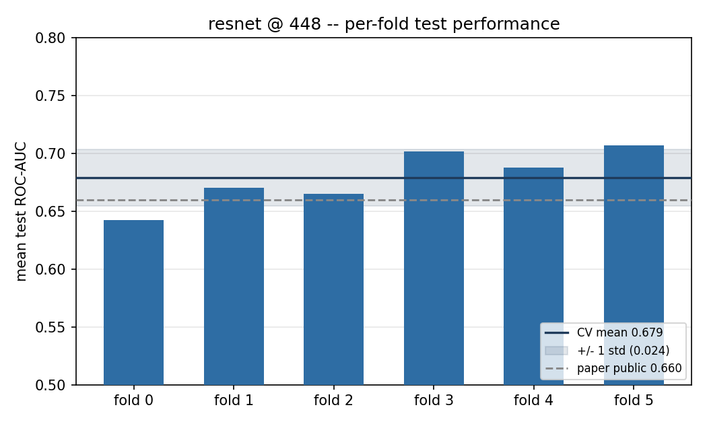
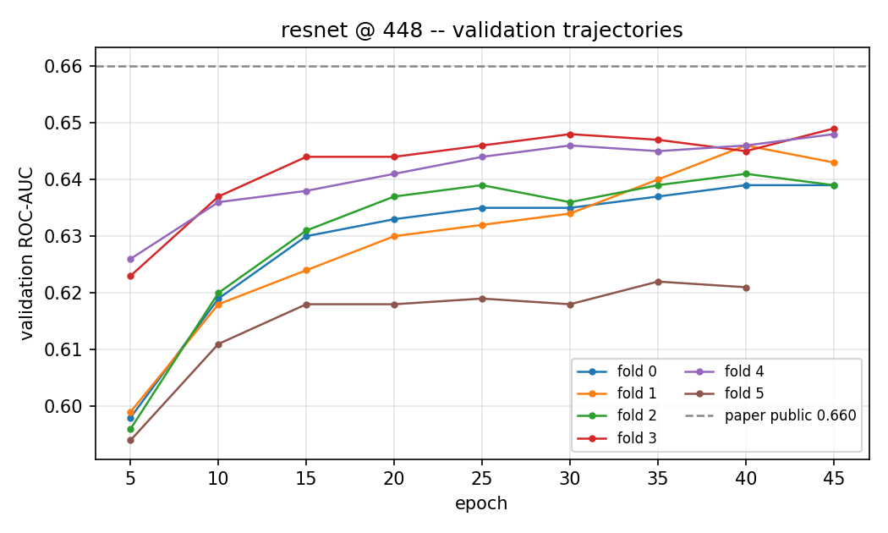
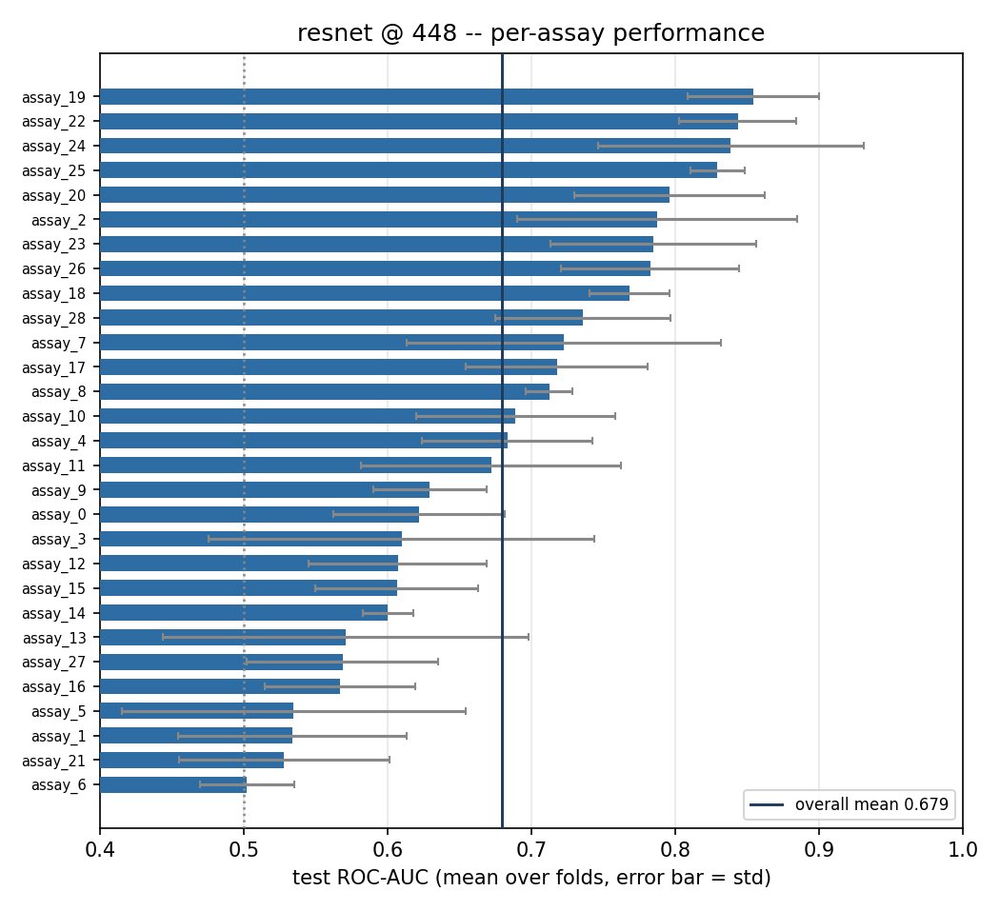
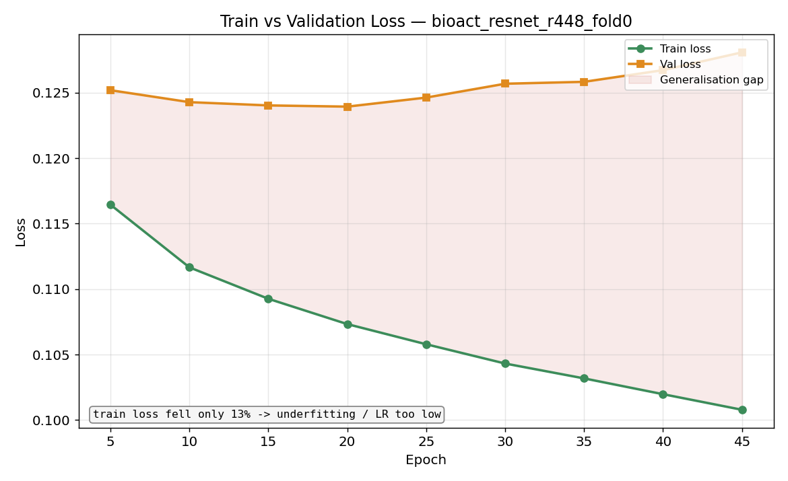
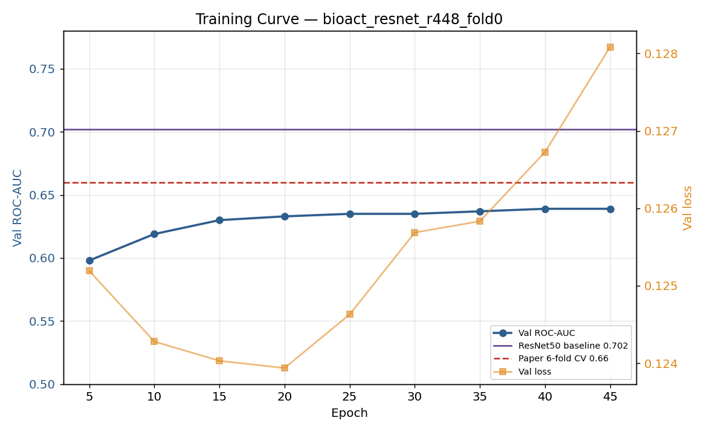
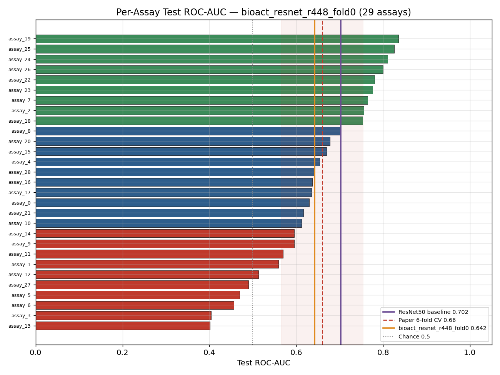
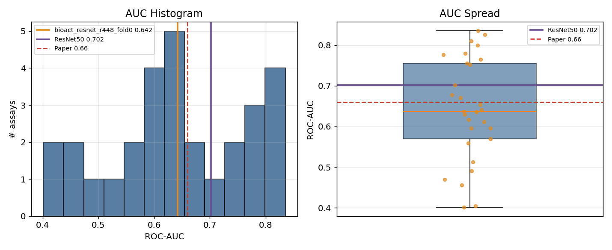
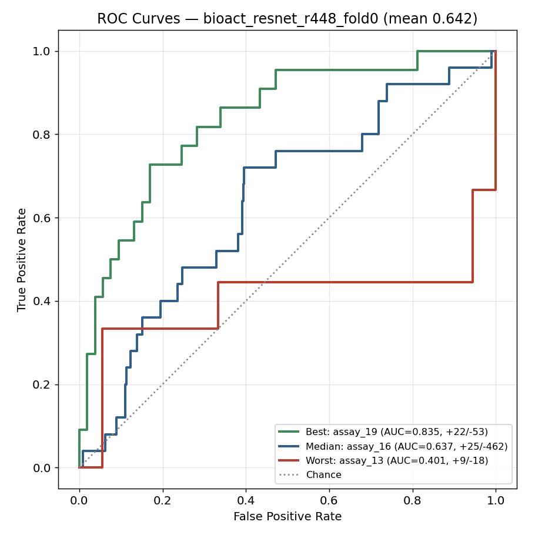
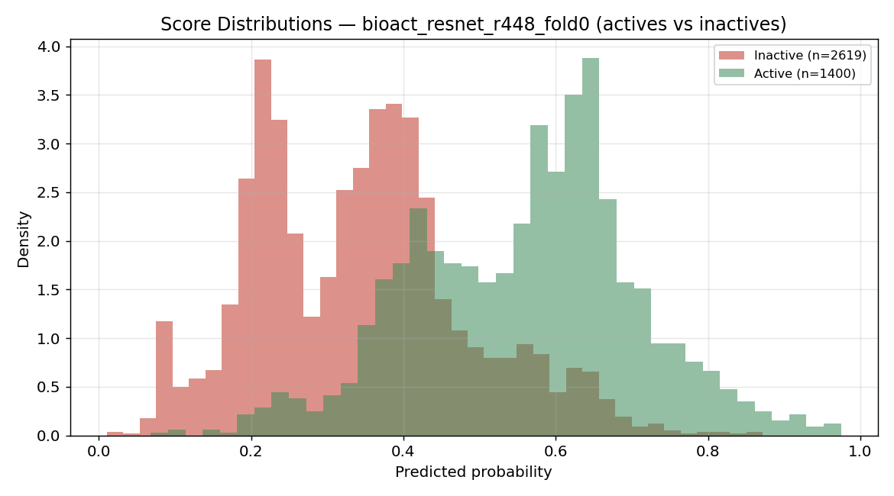
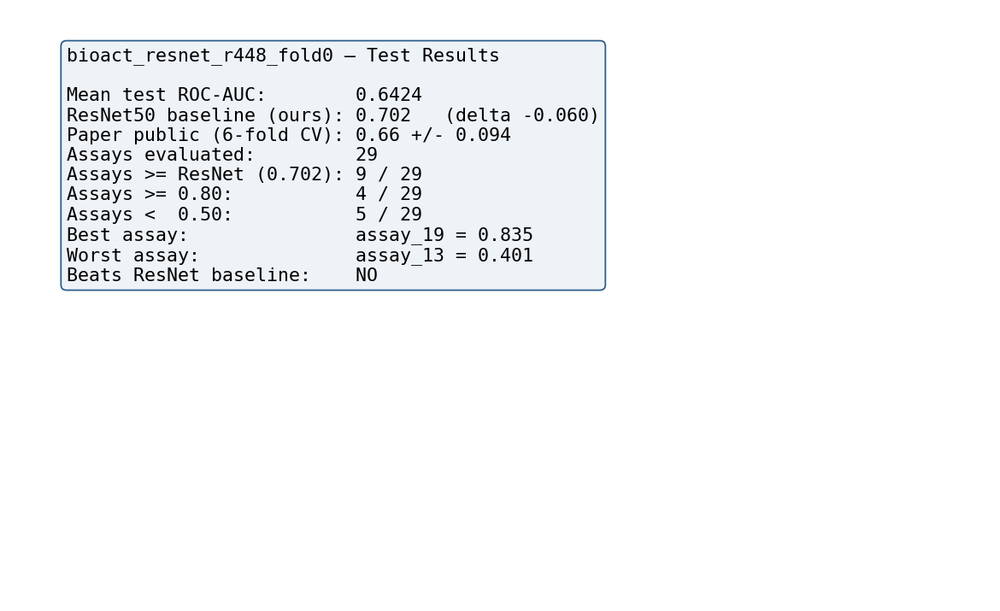

# ResNet50 — 6-Fold Cross-Validation (448×448, faithful replication)

Benchmarking a pretrained ResNet50 on Cell Painting compound-bioactivity
prediction (masked multi-label classification over 29 assays), replicating
Fredin Haslum et al., *Nat Commun* **15**:3470 (2024).

## Headline result

| | mean test ROC-AUC | std |
|---|---|---|
| **This work (6-fold CV)** | **0.6792** | **± 0.0245** |
| Paper (public JUMP-CP, 6-fold) | 0.660 | ± 0.094 |

The cross-validated mean sits slightly above the paper's public benchmark and
well within its confidence band, with a substantially tighter spread across
folds. This is a faithful reproduction of the published result.

## Per-fold test performance

| fold | held-out test | mean test ROC-AUC |
|---|---|---|
| 0 | fold 0 | 0.6424 |
| 1 | fold 1 | 0.6705 |
| 2 | fold 2 | 0.6652 |
| 3 | fold 3 | 0.7019 |
| 4 | fold 4 | 0.6878 |
| 5 | fold 5 | 0.7071 |
| **mean** | | **0.6792 ± 0.0245** |

Each fold holds out a different sixth of the data for testing, validates on the
next, and trains on the remaining four — so every fold serves as the test set
exactly once. Full numbers in [`cv/cv_summary.csv`](cv/cv_summary.csv) and
per-assay breakdown in [`cv/cv_per_assay.csv`](cv/cv_per_assay.csv).

## Cross-validation graphs

**Per-fold test performance**, with the CV mean, ±1 std band, and the paper's
public benchmark for reference:

**Validation trajectories** for all six folds over training:

**Per-assay performance** — mean ROC-AUC across folds per assay, error bars =
std across folds:

## Fit diagnostic — training vs validation loss

Requested to assess over- vs under-fitting. The diagnostic is the gap between
the two curves: training and validation loss fall together early, then the gap
widens as validation loss flattens — the onset of mild overfitting, consistent
with the model reaching its best validation performance and the best checkpoint
being retained.

## Representative fold (fold 0) — full diagnostics

The complete per-fold graph set, shown for fold 0 as a representative example.

**Training curve** (validation ROC-AUC and loss over epochs):

**Per-assay test ROC-AUC**:

**AUC distribution across assays**:

**ROC curves** (best / median / worst assay):

**Predicted-score distributions** (actives vs inactives):

**Summary panel**:

## Statistical comparison (Wilcoxon) — pending

A Wilcoxon signed-rank test compares two models fold-by-fold. It will be added
here once a second architecture (e.g. DINOv2, CLIP, BiomedCLIP) completes its
own 6-fold CV, to test whether the per-fold differences between models are
statistically significant.

## Method notes

- **Data**: JUMP-CP Cell Painting, 5 fluorescence channels (DNA, ER, RNA, AGP,
  Mito) per field of view, packed as a single wide 8-bit PNG and split back to
  a `[1080, 1080, 5]` tensor at load time. First conv layer adapted 3→5 channels.
- **Crop**: 448×448 (paper-faithful; `Resize` off), from 1080×1080 images.
- **Loss**: masked binary cross-entropy over 29 assays.
- **Best-checkpoint selection**: the tested model is the best-validation
  checkpoint per fold.
- **Hardware**: University Kubernetes cluster, six folds trained in parallel
  (one GPU each).
